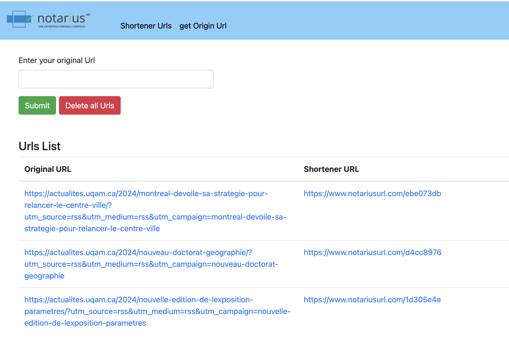
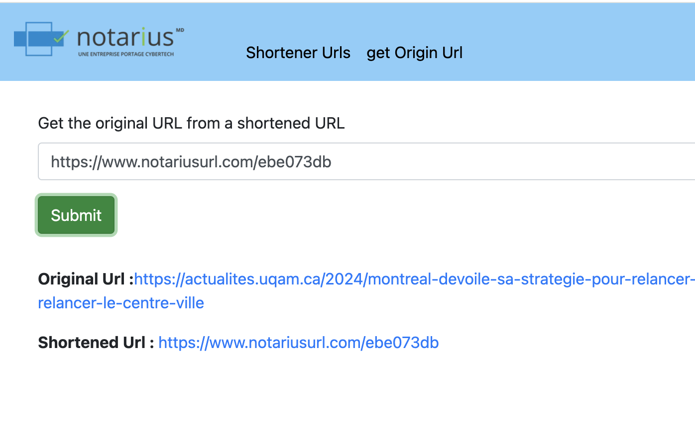
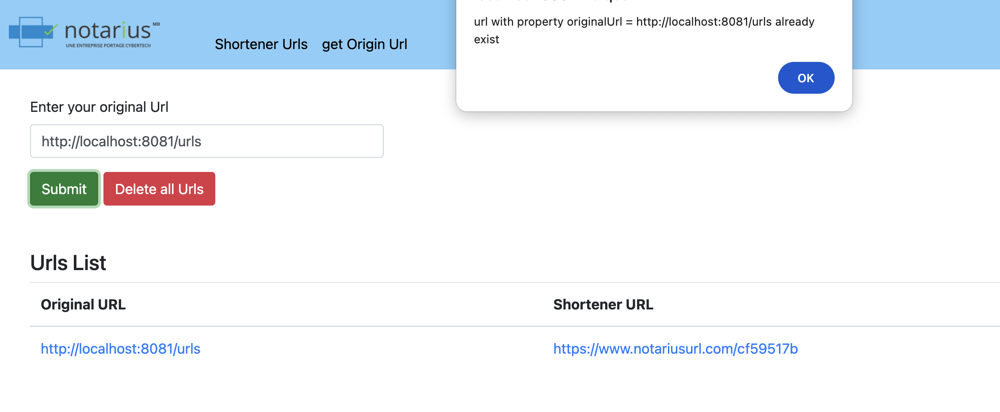

# Angular Client for URL Shortener Application

This Angular application is designed to interact with a backend Spring Boot API for URL shortening. Follow the steps below to set up and run the Angular client.

## Prerequisites

Make sure you have the following software installed on your machine:

- Node.js and npm
- Angular CLI

## Setup Instructions

1. Clone the repository:

    ```bash
    git clone <repository-url>
    ```

2. Install dependencies:

    ```bash
    npm install
    ```

3. Running the Application:

    ```bash
    npm ng serve --port 8081
    ```

## Features

### 1. Generate Shortened URLs

Navigate to the "Generate Shortened URL" section to input an URL and generate a shortened version.



### 2. Display List of URLs

View the list of generated URLs in the "List of URLs" section.

### 3. Retrieve Original URL from Shortened URL

In the "Get Original URL from Shortener" section, enter a shortened URL to retrieve its original.



### 4. Showcase Backend Errors through Alerts

The application will display alerts in case of backend errors.


### 5. Delete All URLs

Use the "Delete All URLs" feature to clear the list of generated URLs.

